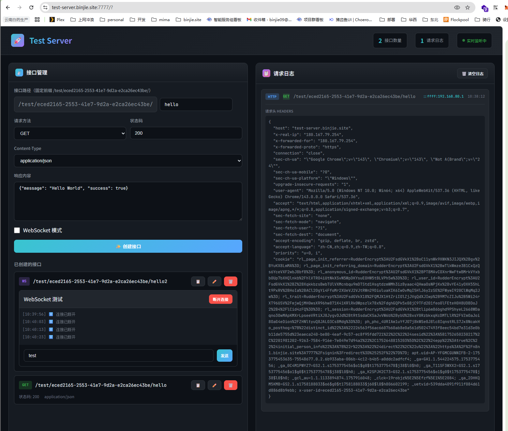

# Test Server - 测试接口生成器 🚀

一个用于快速生成测试接口的工具，支持 HTTP 和 WebSocket 协议，可以实时查看请求日志。



## ✨ 功能特性

- **动态创建接口**：通过 Web 界面快速创建测试接口
- **自定义响应**：支持自定义响应内容、状态码、Content-Type
- **WebSocket 支持**：创建 WebSocket 端点，实时收发消息
- **实时日志**：查看所有请求的详细信息（IP、请求头、请求体等）
- **一键部署**：支持 Docker Compose 一键启动

## 🚀 快速开始

### 方式一：Docker Compose（推荐，已内置 Mongo）

```bash
# 克隆项目
git clone <your-repo-url>
cd test-server

# 一键启动
docker-compose up -d

# 访问界面
# http://localhost:3001
```

### 方式二：本地开发（需本地 Mongo）

```bash
# 安装依赖
npm install

# 准备环境变量（示例）
# PORT=3131
# MONGODB_URI=mongodb://localhost:27017/test-server
# NODE_ENV=development

# 启动开发服务器（前后端同时启动）
npm run dev

# 前端: http://localhost:5173
# 后端: http://localhost:3001
```

### 方式三：生产部署

```bash
# 安装依赖
npm install

# 构建前端
npm run build

# 启动服务器
npm start

# 访问 http://localhost:3001
```

## 📖 使用说明

### 身份与数据隔离
- 每个访问用户会分配一个唯一身份 ID（保存在 cookie）
- 仅能看到自己创建的接口与日志
- 接口路径全局去重（路径 + 方法），避免冲突
- 默认新接口路径：`/test/{用户ID}/hello`

### 创建 HTTP 接口

1. 在左侧面板填写接口信息：
   - **接口路径**：如 `/test/users`
   - **请求方法**：GET、POST、PUT、DELETE
   - **状态码**：如 200、404、500 等
   - **Content-Type**：响应类型
   - **响应内容**：自定义 JSON 或文本响应

2. 点击「创建接口」按钮

3. 使用生成的 URL 进行测试：
   ```bash
   curl http://localhost:3001/test/users
   ```

### 创建 WebSocket 接口

1. 勾选「WebSocket 模式」
2. 填写接口路径
3. 点击「创建接口」
4. 在接口卡片中点击「连接」进行测试
5. 使用输入框发送消息

### 查看请求日志

- 右侧面板实时显示所有请求日志
- 点击日志条目可展开查看详细信息：
  - 请求头 (Headers)
  - 查询参数 (Query)
  - 请求体 (Body)
  - WebSocket 消息内容

## 🔧 API 参考

### 管理接口

| 方法 | 路径 | 描述 |
|------|------|------|
| GET | `/api/endpoints` | 获取所有接口列表 |
| POST | `/api/endpoints` | 创建新接口 |
| PUT | `/api/endpoints/:id` | 更新接口 |
| DELETE | `/api/endpoints/:id` | 删除接口 |
| GET | `/api/logs` | 获取请求日志 |
| DELETE | `/api/logs` | 清空日志 |

### WebSocket 端点

- `ws://localhost:3001/ws?type=logs` - 日志实时推送
- `ws://localhost:3001/ws?type=test&endpoint={id}` - 测试连接

## 🐳 Docker 配置

### 环境变量

| 变量 | 默认值 | 描述 |
|------|--------|------|
| PORT | 3001 | 服务端口 |
| NODE_ENV | production | 运行环境 |

### 自定义配置

```yaml
# docker-compose.yml
services:
  test-server:
    ports:
      - "8080:3001"  # 修改外部端口
    environment:
      - PORT=3001
```

## 📁 项目结构

```
test-server/
├── src/                  # 前端源码
│   ├── App.jsx          # 主应用组件
│   ├── main.jsx         # 入口文件
│   └── styles.css       # 样式文件
├── server.js            # Express 后端
├── vite.config.js       # Vite 配置
├── package.json         # 依赖配置
├── Dockerfile           # Docker 镜像配置
├── docker-compose.yml   # Docker Compose 配置
└── README.md           # 说明文档
```

## 🛠️ 技术栈

- **前端**：React 18 + Vite
- **后端**：Express + ws (WebSocket)
- **容器**：Docker + Docker Compose

## 📝 License

MIT License


